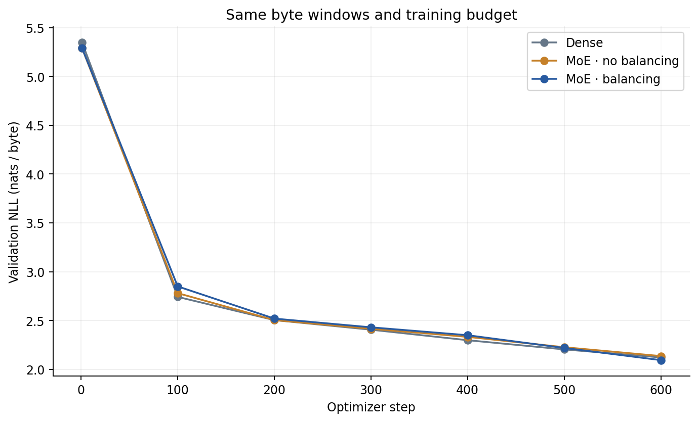
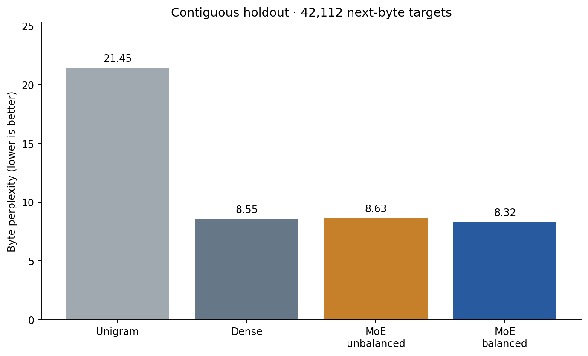
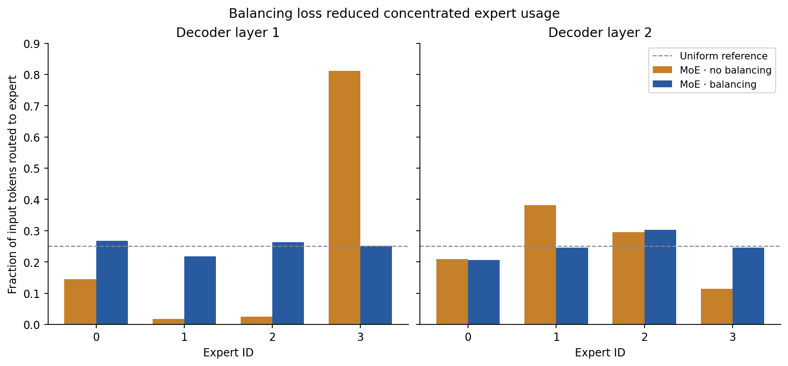
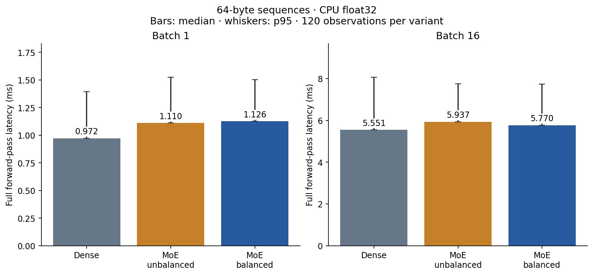
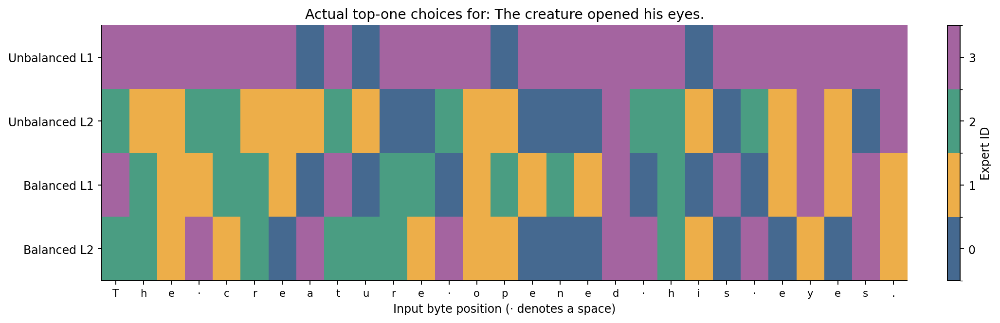
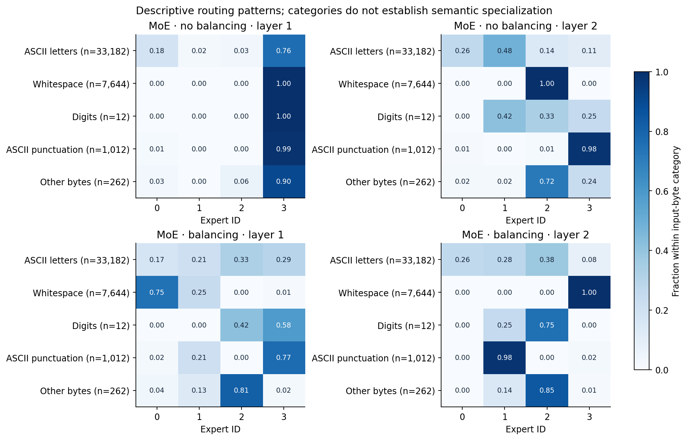

# RouteForge

A TensorFlow mixture-of-experts decoder built from scratch to measure how sparse routing and load balancing change model quality, expert usage and inference cost.

---

## Overview

**What happens when four feed-forward experts share a decoder, but each token uses only one?** RouteForge implements the router, token dispatch and output reconstruction directly. A controlled ablation compares dense feed-forward layers with top-one routing, both with and without an auxiliary balancing loss.

The reusable component is `SparseExperts`: a TensorFlow layer that returns routed outputs, an explicit balancing term and diagnostic tensors. The repository also includes three trained byte decoders, a CLI that traces expert choices and a measured CPU benchmark.

* **Task:** Autoregressive byte prediction and sparse-routing architecture analysis.
* **Dataset:** 421,536 UTF-8 bytes from *Frankenstein*; vocabulary of 256 byte IDs.
* **Best validation model:** **Balanced MoE**, with holdout byte perplexity **8.3231**.
* **Dense comparison:** Holdout byte perplexity **8.5521**.
* **Unigram baseline:** Holdout byte perplexity **21.4486**.

The main result is a useful tradeoff: balancing improved expert usage and slightly improved prediction quality in this run, while sparse models remained slower than dense on this CPU. These are small research decoders, not instruction-tuned LLMs.

---

## Key Results

### Validation checkpoint selection

Each architecture was fixed before training and selected its own lowest validation NLL checkpoint. All three selected step 600. The sparse variants began with **identical initial weights**, verified by their SHA-256 fingerprints, and used the same sampled windows in the same order.

| Model | Balancing Weight | Total Parameters | Nominal Active Parameters / Token | Validation NLL ↓ |
| :--- | ---: | ---: | ---: | ---: |
| Dense | 0 | 103,040 | 103,040 | 2.1233 |
| MoE without balancing | 0 | 251,008 | 103,552 | 2.1372 |
| **MoE with balancing** | **0.01** | **251,008** | **103,552** | **2.0955** |

The active-parameter estimate counts all shared weights and one expert per layer, including embeddings in full. It is not a FLOP measurement or a memory reduction: every expert's weights remain resident. Dense and sparse have different total capacity, so the dense comparison is not parameter matched.

### Final holdout evaluation

The contiguous test split contains 42,154 bytes. Evaluation uses 658 nonoverlapping 64-byte input windows and **42,112 next-byte targets**, with positions reset at each window. Byte perplexity is `exp(mean NLL)` and should not be compared directly with subword perplexity from larger models.

| Model | NLL (nats/byte) ↓ | Byte Perplexity ↓ | Next-byte Accuracy ↑ |
| :--- | ---: | ---: | ---: |
| **Balanced MoE** | **2.1190** | **8.3231** | **37.24%** |
| Dense | 2.1462 | 8.5521 | 36.71% |
| Unbalanced MoE | 2.1548 | 8.6266 | 35.90% |
| Unigram baseline | 3.0657 | 21.4486 | — |

The baseline uses training-only byte counts with Laplace smoothing (`α = 1`); its accuracy was not recorded. Window-loss standard deviations are in `runs/metrics.json`. These describe adjacent book passages, not independent cross-validation folds. One corpus, one seed and one budget do not establish a general MoE advantage.

### Expert load

Each layer routed all **42,112 test input tokens**, with zero dropped tokens. The busiest expert's share shows how concentrated the assignments became:

| Model | Layer 1: Busiest Expert Share | Layer 2: Busiest Expert Share | Layer 1: Maximum / Mean Load | Unused Experts |
| :--- | ---: | ---: | ---: | ---: |
| Unbalanced MoE | 81.22% | 38.16% | 3.249× | 0 |
| Balanced MoE | **26.74%** | **30.20%** | **1.070×** | 0 |

Uniform usage would be 25% per expert. The unbalanced layer did not leave experts completely unused, but it sent most tokens to one expert. The balancing term substantially reduced this concentration in the measured ablation. Expert IDs are arbitrary within each model; expert 3 in one checkpoint need not correspond to expert 3 in another.

### CPU inference

The benchmark measures a complete 64-byte sequence forward pass, including routing and synchronized logit materialization. It is **not** autoregressive generation latency. There are six fixed held-out input cases, 20 timed trials and 120 observations per model/batch setting: **720 observations** in total.

| Batch | Model | Median (ms) ↓ | p95 (ms) ↓ | Speed Ratio vs Dense ↑ |
| ---: | :--- | ---: | ---: | ---: |
| 1 | Dense | **0.972** | 1.395 | 1.000× |
| 1 | Unbalanced MoE | 1.110 | 1.524 | 0.876× |
| 1 | Balanced MoE | 1.126 | 1.502 | 0.864× |
| 16 | Dense | **5.551** | 8.066 | 1.000× |
| 16 | Unbalanced MoE | 5.937 | 7.759 | 0.935× |
| 16 | Balanced MoE | 5.770 | 7.745 | 0.962× |

Speed ratio is dense median divided by the variant median; values below one mean slower. Sparse dispatch activates one expert per token, but partitioning, stitching, gate calculations and smaller expert matrix operations add overhead. The current implementation does not demonstrate a CPU speedup.

Loading and three warmups per case/model are excluded. Execution order rotates by trial and case and reverses on odd trials. TensorFlow uses CPU float32, two intra-op and two inter-op threads, with oneDNN disabled. The host is shared; these timings do not predict GPU, distributed or production-serving performance. One compiled graph per model served both measured batch sizes.

---

## Architecture

All models use two decoder blocks, width 64, four attention heads, context 64 bytes, learned token/position embeddings, pre-layer normalization, causal attention, SwiGLU feed-forward layers and tied input/output embeddings. Each feed-forward expert has hidden width 128; the dense feed-forward layer has the same dimensions as one expert.

### Top-one routing

1. Flatten the hidden states into token rows and compute a linear router's four softmax probabilities.
2. Select one expert per token using argmax. Partition the token indices by selected expert.
3. Send only the selected token rows into each expert. Empty partitions skip the expert matrix operations.
4. Multiply each expert output by its selected softmax gate probability and stitch the rows back into their original positions.
5. Add the routed output through the decoder residual connection.

The selected probability is retained rather than normalized to one. This gives the router a differentiable task-loss path through its gate weight; the discrete argmax itself has no gradient. The focused tests compare both outputs and gradients against an explicit reference that evaluates all experts and selects the same results.

There is no fixed capacity, overflow queue, token dropping, router jitter or router z-loss. This is single-device routing, with no expert-parallel communication. Padding masks and mixed precision are outside the implemented layer contract.

### Balancing term

For `E` experts, the per-layer term is:

$$L_{balance} = E \sum_{i=1}^{E} f_i P_i$$

Here `f_i` is the fraction of assigned token rows and `P_i` is the mean softmax probability for expert `i`. Assignment fractions are stopped gradients. The decoder averages this term across its two layers and adds `0.01 × mean(L_balance)` to next-byte NLL for the balanced variant. The other variants use coefficient zero.

The design follows [Fedus, Zoph and Shazeer, *Switch Transformers*](https://jmlr.org/papers/v23/21-0998.html). The routing principle is attributed to that work; RouteForge supplies its own SwiGLU implementation, no-drop dispatch, small-corpus training and measurements. A low auxiliary value alone is not proof of balanced assignments, so actual counts are recorded separately.

### Training controls

All models trained from random initialization with seed `42`, 600 steps, batch size `16`, Adam learning rate `0.001` and global gradient clipping `1.0`. The shared schedule contains 614,400 sampled byte targets per model; windows can recur. The schedule itself is included in `runs/training_starts.npy`.

The sparse ablation changes only the balancing coefficient. Dense has a different parameter layout; the same seed does not imply identical dense/sparse shared weights. There are no pretrained weights, distillation targets, repeated seed searches or test-driven hyperparameter changes.

---

## Data Summary and Error Analysis

* **Source:** [Mary Wollstonecraft Shelley, *Frankenstein*, Project Gutenberg ebook 84](https://www.gutenberg.org/ebooks/84).
* **License:** The source identifies the work as public domain in the USA. The complete book is referenced, not redistributed.
* **Preparation:** Keep the body between the single Gutenberg start/end markers, normalize CRLF to LF, strip outer whitespace and append one final LF. Encode as UTF-8 byte IDs 0–255; no fitted vocabulary.
* **Split:** Contiguous 337,228 / 42,154 / 42,154 bytes for train / validation / test. No input/target window crosses a split. Repeated phrases are retained, so this measures within-book prediction.
* **Verification:** Full downloaded source and transformed body are compared byte for byte with a fresh public download. Source and body SHA-256 values are in `data/manifest.json`.

`runs/error_analysis.json` records the five highest-loss test windows for each checkpoint, with exact input bytes and source offsets. The balanced model's five worst windows have NLL **2.5627–2.6322**, above its overall **2.1190**. Their text includes compounds, less common word sequences and emphatic dialogue. These examples locate difficult passages; they do not prove which feature caused the errors.

Fixed-prompt samples remain misspelled, repetitive and semantically weak. Raw bytes are retained in `sample.bin`; `sample.txt` uses replacement characters if needed. Improved teacher-forced byte scores should not be read as fluent generation or reasoning ability.

The category diagnostic groups input bytes into ASCII letters, whitespace, digits, ASCII punctuation and other bytes. It includes the count for every category. These descriptive patterns do not establish named expert skills, semantic specialization or reliable behavior on another domain.

---

## Visualizations

| Validation learning curves | Holdout quality |
| :---: | :---: |
|  |  |

| Actual expert usage | CPU inference latency |
| :---: | :---: |
|  |  |

| Byte-by-byte route trace | Routing by input-byte category |
| :---: | :---: |
|  |  |

---

## Verification and Repository Structure

**10 correctness tests passed**, including sparse/reference output and gradient equality, original token ordering, empty experts, no dropped tokens, auxiliary gradients, causal masking, batch independence and checkpoint reload.

`verify.py` independently checks initialization fingerprints, the saved training schedule, validation/holdout scores, error windows, fixed samples, category counts, route traces and all 36 benchmark output hashes. It recalculates timing summaries from the 720 raw observations. It does not retrain the models or promise identical wall-clock measurements.

| Path | Purpose |
| :--- | :--- |
| `routeforge/model.py` | Reusable sparse layer, causal decoder and checkpoint loader. |
| `inspect_routes.py` | CLI returning each byte's expert IDs and gate probabilities. |
| `generate.py` | Local byte generation with a selected checkpoint. |
| `prepare.py`, `study.py` | Hash-checked corpus preparation and fixed-budget training. |
| `benchmark.py`, `diagnostics.py` | Timing observations, routing categories and fixed samples. |
| `plots.py`, `figures/` | Figures rendered from executed measurements. |
| `runs/dense/`, `runs/unbalanced/`, `runs/balanced/` | Configurations, weights, test-window losses and samples. |
| `runs/metrics.json` | Quality scores, expert counts, controls and runtime. |
| `runs/benchmark.json` | Raw latency records, input IDs, output hashes and summaries. |
| `runs/routing_diagnostics.json` | Category counts and exact fixed-input traces. |
| `runs/training_history.csv`, `runs/training_starts.npy` | Actual learning observations and sampled windows. |
| `runs/error_analysis.json` | Highest-loss windows and source offsets. |
| `data/manifest.json`, `audit.json` | Source attribution, replay checks and artifact hashes. |
| `tests/`, `USAGE.md` | Focused tests, CLI instructions and layer integration contract. |

See [USAGE.md](USAGE.md) to use the checkpoints or add `SparseExperts` to another TensorFlow model. Generation and inspection require no external model API or corpus download.

## Attribution

Built for Saud Alotaibi with AI-assisted implementation, experiment execution and documentation. Every published result comes from the executed study files. Human review is not claimed. The software is MIT licensed; external research and corpus attribution remain explicit.
